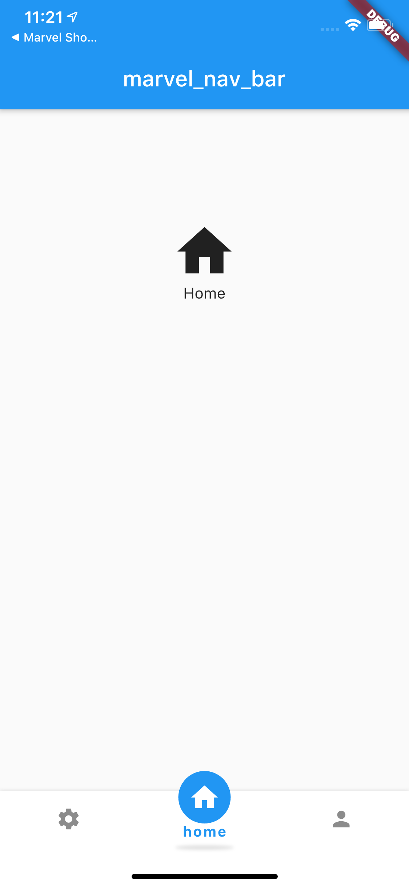
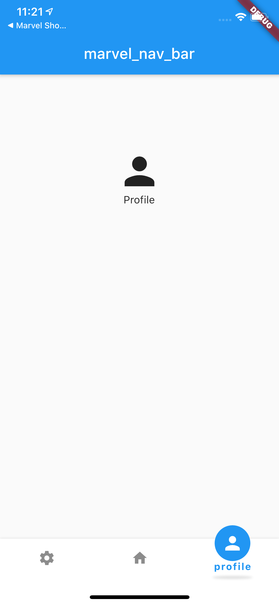

<<<<<<< HEAD
f
=======
# marvel_nav_bar

marvel_nav_bar support custom bottom navigation bar, with smart design that allow animations item when seleced,
so can customize designing as you want, by controlling size, colors, animated items.

  
## Features  
  
 - Can Customize size, color navigation bar.
 - So can customize items.
 - Control with animated item when selected,that animated upon container bottom, 
 - Customize the style, themes font texts, widgets.
 - Refersh state when selected item in bottom navigation, and body contents.
 - Easy to use.
  
## Usage

    marvel_nav_bar: 0.0.1
    
    //add this to pubspec.yaml file
    
    import 'package:liquid_progress_indicator/liquid_progress_indicator.dart';
    //so to use lib call it as  up line

### MarvelNavBar using:
this below inside bottomNavigationBar

,,,
MarvelNavBar(
        items: [
          MarvelNavItem(iconData: Icons.settings,label: 'setting',),
          MarvelNavItem(iconData: Icons.home,label: 'home',),
          MarvelNavItem(iconData: Icons.person,label: 'profile',),
        ],
        theme:
        MarvelNavTheme(
          unselectedItemIconColor: Colors.black45,
          unselectedItemTextStyle: TextStyle(
              fontSize: 1.0,
              color: Colors.black45,
              fontWeight: FontWeight.normal,
              height: 0),
          selectedItemLabelColor: Colors.blue,
          showSelectedItemShadow: true,
          unselectedItemBackgroundColor: Colors.transparent,
          selectedItemIconColor: Colors.white,
          selectedItemBackgroundColor: Colors.blue,
          unselectedItemLabelColor: Colors.white,
          barBackgroundColor: Colors.white,
          selectedItemTextStyle:TextStyle(
              fontSize: 13.0,
              color: Colors.blue,
              fontWeight: FontWeight.bold,
              height: 1.2),),
        selectedIndex: currentIndex,    
        onSelectTab: (index) {
          onSelectedTab(index);
        },
      ),
    body: ...
    ,,,
    
 ### To more details visit 
 http://marvelsystems.com.sa/
 https://pub.dev/packages/marvel_nav_bar
>>>>>>> ce136cebfc9537fb65f3200cf1f1c057db299b89
